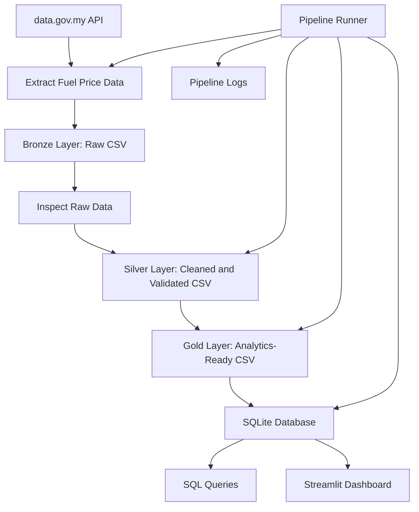

## Project Structure

```text
malaysia-open-data-pipeline/
│
├── dashboard/
│   └── app.py
│
├── data/
│   ├── bronze/
│   │   └── .gitkeep
│   ├── silver/
│   │   └── .gitkeep
│   └── gold/
│       └── .gitkeep
│
├── database/
│   └── .gitkeep
│
├── logs/
│   └── .gitkeep
│
├── screenshots/
│   ├── dashboard.png
│   └── pipeline_success.png
│
├── sql/
│   └── sample_queries.sql
│
├── src/
│   ├── extract/
│   │   └── extract_fuel_prices.py
│   │
│   ├── transform/
│   │   ├── clean_fuel_prices.py
│   │   └── build_gold_fuel_prices.py
│   │
│   ├── inspect_bronze_fuel.py
│   ├── load_gold_to_sqlite.py
│   ├── query_fuel_database.py
│   └── run_pipeline.py
│
├── .gitignore
├── requirements.txt
└── README.md
```

## Pipeline Architecture



## Core Features

- Extracts real Malaysian fuel price data from the data.gov.my API
- Stores raw source data in a bronze layer
- Cleans and validates actual fuel price records in a silver layer
- Builds gold analytics tables for monthly averages, latest prices, and weekly changes
- Loads gold tables into a SQLite database
- Provides sample SQL queries for analysis
- Runs the full ETL process using one pipeline command
- Saves pipeline execution logs
- Visualizes results using a Streamlit dashboard